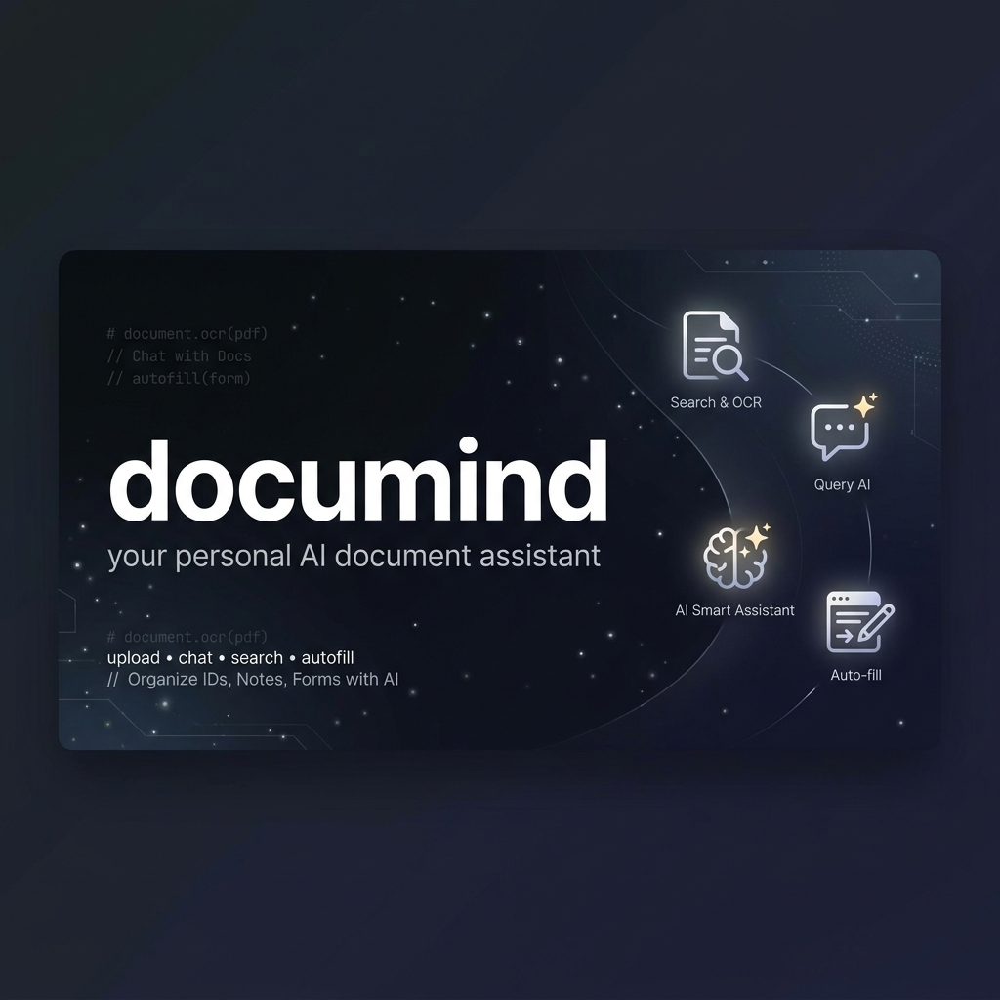

<div align="center">


# documind

**personal ai document assistant — chat with your docs, auto-fill forms**

[](https://react.dev)
[](https://www.typescriptlang.org)
[](https://ai.google.dev)
[](LICENSE)

</div>

an intelligent document assistant that extracts information from your uploaded documents and lets you query them through a chatbot — powered by gemini. upload an id, a certificate, or even handwritten notes, and documind builds a personal knowledge base you can chat with and use to auto-fill forms.

```
┌──────────────────────────────────────────────────┐
│                  documind                        │
│                                                  │
│  ┌─────────────┐    ┌─────────────────────────┐  │
│  │  sidebar     │    │     chat interface      │  │
│  │              │    │                         │  │
│  │  actions:    │    │  user: "what's my       │  │
│  │  • upload    │    │         passport no?"   │  │
│  │  • add note  │    │                         │  │
│  │  • form fill │    │  ai: "your passport     │  │
│  │              │    │       number is ..."    │  │
│  │  knowledge   │    │                         │  │
│  │  base:       │    │  ┌───────────────────┐  │  │
│  │  • doc.jpg   │    │  │ image attachment  │  │  │
│  │  • notes.txt │    │  │ support           │  │  │
│  │              │    │  └───────────────────┘  │  │
│  │  saved       │    │                         │  │
│  │  analyses    │    │  ┌───────────────────┐  │  │
│  │              │    │  │ form fill results │  │  │
│  └─────────────┘    │  └───────────────────┘  │  │
│                      └─────────────────────────┘  │
│                         │                         │
│                    ┌────▼────┐                     │
│                    │ gemini  │  vision + chat      │
│                    │  2.5    │  + function calling │
│                    │  flash  │                     │
│                    └─────────┘                     │
└──────────────────────────────────────────────────┘
```

## what it does

documind lets you build a personal document vault, then talk to it. upload images of your passport, aadhar card, certificates — anything with text — and gemini extracts the content using vision. from there you can:

- **chat with your docs** — ask questions like "what's my date of birth?" or "when does my passport expire?" and get answers sourced from your uploaded documents
- **ocr via gemini vision** — upload images (png, jpeg, webp) and gemini extracts all visible text automatically
- **add manual notes** — type in information directly (e.g. "my employee id is XYZ") to expand your knowledge base
- **auto-fill forms** — upload an image of a blank form, and documind matches fields to your stored documents, producing a table of field → value → source
- **correct documents via chat** — tell the ai "my name is actually John, not Jon" and it uses function calling to fix the stored text directly
- **image attachments in chat** — attach images mid-conversation for contextual analysis
- **per-user accounts** — local auth with localStorage persistence, each user gets their own document vault and chat history
- **saved form analyses** — recent form fill results are persisted and can be reviewed anytime

## tech stack

| layer | tech |
|-------|------|
| framework | react 18 + typescript |
| build | vite 5 |
| styling | tailwind css (cdn) |
| ai | google gemini 2.5 flash (`@google/genai`) |
| auth | custom localStorage hook |

## setup

### prerequisites

- node.js 18+
- a [gemini api key](https://aistudio.google.com/)

### run locally

```bash
git clone https://github.com/swarajduttacv/dm.git
cd dm
npm install
```

create a `.env.local` file:

```
VITE_API_KEY=your_gemini_api_key_here
```

start the dev server:

```bash
npm run dev
```

## project structure

```
├── App.tsx                  # root component, auth routing
├── index.tsx                # react entry point
├── index.html               # html shell with tailwind + theme config
├── types.ts                 # typescript interfaces
├── vite-env.d.ts            # vite environment type declarations
├── components/
│   ├── AuthForm.tsx         # login/signup form
│   └── MainApp.tsx          # main app shell — sidebar, chat, modals
├── services/
│   └── geminiService.ts     # gemini ai — ocr, chat sessions, form filling
├── hooks/
│   └── useAuth.ts           # auth + document CRUD via localStorage
├── package.json
├── vite.config.ts
└── tsconfig.json
```

## how it works

### document extraction
when you upload an image, gemini 2.5 flash processes it with vision and extracts all visible text. this gets stored as a `Document` in your local knowledge base.

### chat
the chat uses gemini's multi-turn conversation api. on the first message, it receives the full text of all your documents as context. from there, it answers strictly from that context — no hallucinated info.

### document correction
if you tell the ai something is wrong ("my address is actually 123 Main St, not 456 Oak Ave"), it triggers the `correctDocumentInformation` function call to update the stored text in-place.

### form filling
upload an image of a blank form and documind:
1. identifies all fields in the form image using vision
2. searches your document vault for matching values
3. returns a structured table with field name, suggested value, and source document
4. auto-fills today's date for date fields

results are persisted locally and can be reviewed later.

## license

[MIT](./LICENSE) © Swaraj Dutta 2025–2026
